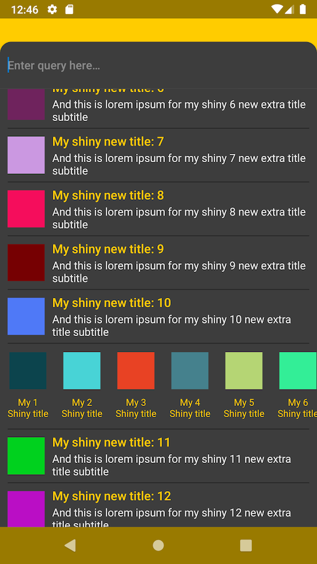

## The best way to explain something is an example
So this is the showcase how one can populate a RecyclerView with different types of items:
- No switch-case inside an `RecyclerView.Adapter`.
- No `RecyclerView.Adapter` delegates for each view type.
- Single `RecyclerView.Adapter` class that suits all items in the application.
- Forces you to separate business models from UI models.
- Still can provide more than just 1:1 mapping via a custom `RecyclerView.ViewHolder`. See a nested `RecyclerView` in the example.

Useful links:
- [Lisa Wray's talk at Droidcon NYC 2016](https://www.youtube.com/watch?v=TS_J0Qw4zl0)
- [Epoxy](https://github.com/airbnb/epoxy)
- [Groupie](https://github.com/lisawray/groupie)